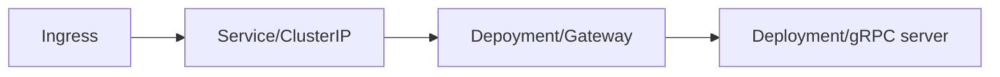

# ToDo Application - Design document

## Introduction

This document contains the technical documentation for the ToDo application. This document provides an overview of the
architectural choices and design principles followed throughout the development of this project.

## API specification

This API adheres to the [Google API Improvement Proposals (AIP)](https://google.aip.dev) guidelines, ensuring a
standardized and efficient design.
Below is a table outlining the various endpoints for CRUD operations within the application.

| Endpoint                  | Service            | Method       | AIP                                   |
|---------------------------|--------------------|--------------|---------------------------------------|
| GET /v1/tasks             | TasksReaderService | GetTask      | [AIP-131](https://google.aip.dev/131) |
| GET /v1/tasks/{id}        | TasksReaderService | ListTasks    | [AIP-132](https://google.aip.dev/132) |
| POST /v1/tasks            | TasksWriterService | CreateTask   | [AIP-133](https://google.aip.dev/133) |
| PATCH /v1/tasks/{task.id} | TasksWriterService | UpdateTask   | [AIP-134](https://google.aip.dev/134) |
| DELETE /v1/tasks/{id}     | TasksWriterService | DeleteTask   | [AIP-135](https://google.aip.dev/135) |
| POST /v1/tasks:undelete   | TasksWriterService | UndeleteTask | [AIP-164](https://google.aip.dev/164) |

Further readings:

- [OpenAPI reference](api/api.swagger.yaml)
- [Google API Improvement Proposals (AIP)](https://google.aip.dev)

### Code generation

This project is using [Protocol buffers](https://protobuf.dev/) as single source of truth. Proto files can be found under the `api/` folder.

In order to avoid repeating code, this project uses a tool called [Buf](https://buf.build/), which allows to generate stubs for different languages: `Go`, `TypeScript` and `Dart` are generated as example and also included in the source code. You can check the [buf.yaml](buf.yaml) and [buf.gen.yaml](buf.gen.yaml) configuration to learn how the different Buf plugins are configured to generate code for this project.

## Domain

The domain of the ToDo application currently has a single entity called Task. Tasks group a definition of what needs to
be done by an API consumer.

In future iterations, this project could extend its domain to contemplate Users, Projects and more.

## Infrastructure

### Running the application

The ToDo Application can be run either locally by using [docker-compose](deployments/local), or be deployed to
a [Kubernetes](deployments/kubernetes) cluster.

#### Kubernetes

The kubernetes set up is rather simple, and it can be found under the `deployments/kubernetes` folder:

NOTE: The ingress was not included due to the many possibilities that can be used for exposing the actual service to the internet.

### Persistence

This application relies on a database engine that can be configured using the `DATABASE_` environment variables found in
the [.env.example](.env.example) file. This would require setting up a MySQL server in production. The local deployment
using [docker-compose](deployments/local) already contains a MySQL server.

### Telemetry

This project implements OpenTelemetry: It's being used to instrument, generate, collect, and export telemetry data (
metrics, logs, and traces) to help you analyze your software’s performance and behavior.

#### Metrics (Prometheus & Grafana)

This application utilizes [Prometheus](https://prometheus.io/), an open-source monitoring system featuring a dimensional
data model, a flexible query language, an efficient time series database, and a modern alerting approach to generate
metrics. These metrics can subsequently be visualized in [Grafana](https://grafana.com/), a multi-platform open-source
analytics and interactive visualization web application. Grafana offers a range of visual elements, including charts,
graphs, and alerts, seamlessly connected to supported data sources.

Configuration for both services can be found in the `configs/` folder under their respective folder names.

Metrics can be disabled by using the environment variable `METRICS_ENABLED=false`.

#### Tracing (Jaeger)

This application incorporates [Jaeger](https://www.jaegertracing.io/), an open-source software designed for tracing
transactions between distributed services. Jaeger serves as a crucial tool for monitoring and troubleshooting complex
microservices environments. With its tracing capabilities, Jaeger provides insights into the flow of transactions,
aiding in the identification and resolution of issues within the distributed architecture.

#### Logging (Zap + stdout)

The application currently logs information to the standard output using [Zap](https://github.com/uber-go/zap), providing
basic visibility into its operations.

To configure different environments, the application relies on the `ENVIRONMENT` environment variable, which accepts the
following values: `production` and `staging`. If no environment is explicitly set, logging will be disabled.

To enhance and centralize the logging process, a [pull request](https://github.com/marcoshuck/todo/pull/52) is in
progress
to enable log aggregation using three key components:

1. **Logstash:** Logstash serves as a powerful log processing pipeline, facilitating the collection, transformation, and
   enrichment of log data. It acts as a central hub for managing logs from various sources.

2. **Elasticsearch:** Elasticsearch acts as a scalable and distributed search and analytics engine. It stores and
   indexes the processed logs, enabling efficient and fast retrieval of log data.

3. **Kibana:** Kibana is an open-source analytics and visualization platform. It provides a user-friendly interface for
   exploring, analyzing, and visualizing log data stored in Elasticsearch. With Kibana, users can create insightful
   dashboards, charts, and graphs to gain deeper insights into the application's performance.

This integrated setup with Logstash, Elasticsearch, and Kibana ensures a robust and comprehensive logging solution,
offering advanced capabilities for log processing, storage, and visualization.
